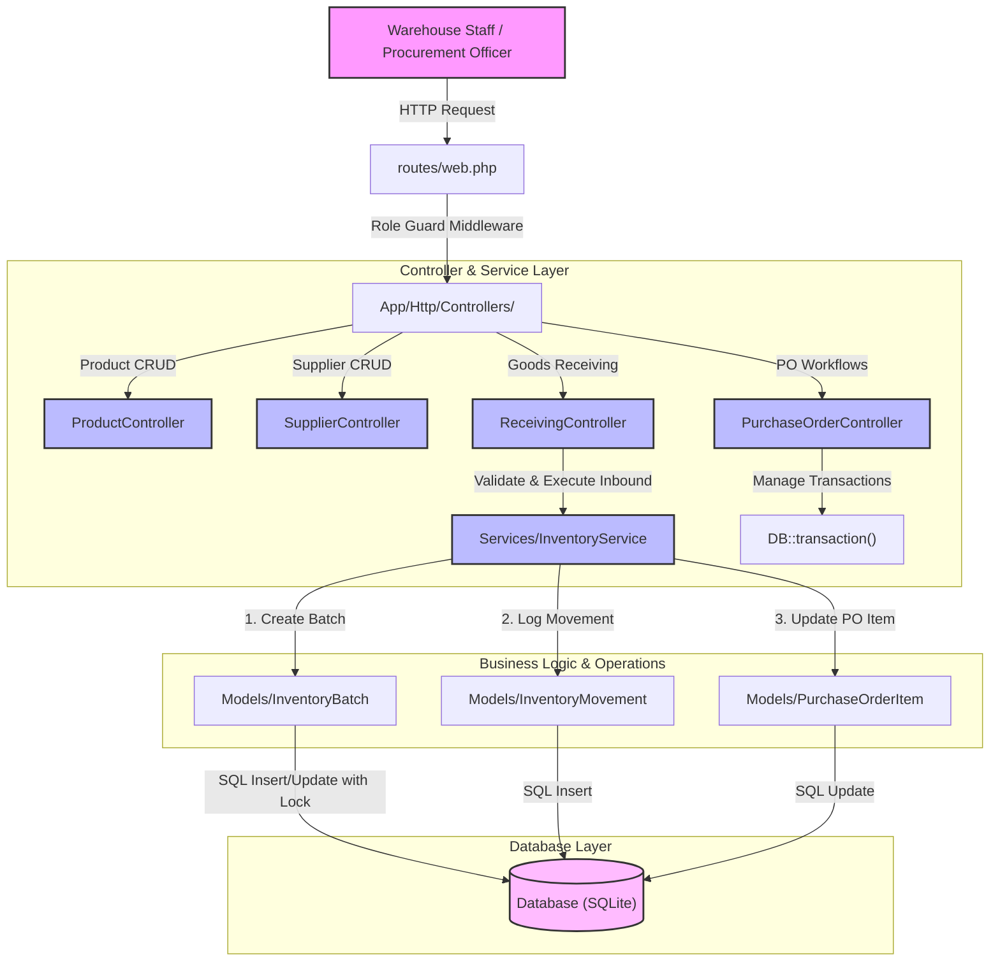

# Phase 1: Inventory & Procurement Foundation - Research

**Researched:** 2026-06-12
**Domain:** Laravel 12, Bootstrap 5.3, Tailwind, AlpineJS, Relational Database, Inventory & Procurement Systems
**Confidence:** HIGH

<user_constraints>
## User Constraints (from CONTEXT.md)

### Locked Decisions
- **D-01 (Catalog Details):** Add nullable string/text columns for category and description to the `products` table for simple cataloging. This keeps the schema simple for the initial MVP while satisfying INV-01.
- **D-02 (Batch Tracking & Expiry):** Make batch numbers and expiry dates optional (nullable) at the database level. If empty at receipt, the system can automatically generate a timestamp-based batch number (e.g., `BATCH-Ymd-His-rand`).
- **D-03 (PO Reconciliation & Discrepancies):** Allow short-shipments; accumulate received quantities on purchase order items. The PO can be marked as 'received' with discrepancies, logging the mismatch in a remarks/adjustment log.
- **D-04 (Supplier-Product Catalog):** Allow any product from the catalog to be added to any supplier's PO (loose association), while recording the supplier ID on the PO itself. Explicit supplier-product mapping is deferred.

### Claude's Discretion
- Standard Laravel Breeze controllers, resource route conventions, and Tailwind/Bootstrap/Alpine.js stack will be used for layouts.

### Deferred Ideas (OUT OF SCOPE)
- Explicit supplier-product mapping is deferred to later phases.
- Multi-warehouse support is out of scope (MVP is single centralized warehouse).
- AI-driven route optimization, bin-level warehouse mapping.
</user_constraints>

<architectural_responsibility_map>
## Architectural Responsibility Map

| Capability | Primary Tier | Secondary Tier | Rationale |
|------------|-------------|----------------|-----------|
| SKU Catalog Management | API/Backend (Laravel) | Browser/Client (Blade + Bootstrap) | Catalog data is stored and validated on the backend, edited/viewed in the browser. |
| Supplier Directory | API/Backend (Laravel) | Browser/Client (Blade + Bootstrap) | Supplier contact data managed via standard CRUD. |
| PO Workflows | API/Backend (Laravel) | Browser/Client (Alpine.js dynamic items) | Creation and lifecycle validation on backend; UI requires Alpine.js to dynamically add/remove items on the front-end before submission. |
| Goods Receiving & Reconciliation | API/Backend (Laravel) | Browser/Client (Blade + Bootstrap) | Inventory updates, batch creation, and movement logs are executed in database transactions on the server. |
| FIFO Stock Consumption | Database/Storage | API/Backend (Laravel) | Stock deductions must execute atomically via DB transactions in FIFO order of batches. |
</architectural_responsibility_map>

<research_summary>
## Summary

This research establishes the core architectural guidelines for Phase 1: Inventory & Procurement Foundation of the Logistics Management Information System (MIS). The core domain covers the master SKU catalog, supplier directory, purchase order workflows, goods receiving and reconciliation, and the database foundation for First-In-First-Out (FIFO) inventory batch tracking. 

The application utilizes a monolith structure with Laravel 12 for robust backend controllers, Blade templates, Bootstrap 5.3 for UI components, Tailwind CSS for custom utility layouts, and Alpine.js for client-side dynamic behaviors (such as dynamic forms for purchase order line items). By combining Bootstrap for structural layout elements and Tailwind for micro-styling, the system retains a neat, premium aesthetic while expediting UI development.

**Primary recommendation:** Centralize all inventory movements and batch deductions in a dedicated service (`InventoryService`) rather than dispersing logic across controllers. Wrap all inventory modifications in database transactions using `DB::transaction()` combined with row locks (`lockForUpdate()`) to prevent race conditions during concurrent stock adjustments.
</research_summary>

<standard_stack>
## Standard Stack

### Core
| Library | Version | Purpose | Why Standard |
|---------|---------|---------|--------------|
| PHP | ^8.2 | Execution environment | Modern, performant OOP features, type safety. |
| Laravel Framework | ^12.0 | Full-stack MVC backend | Robust ORM (Eloquent), built-in validation, routing, authentication, and database transactions. |
| Bootstrap | ^5.3.8 | Frontend UI component styling | Pre-built responsive layout utilities, alerts, modals, dropdowns, forms. |
| Tailwind CSS | ^3.1.0 | Micro-utility frontend styling | High developer velocity for fine-grained spacing, custom flexbox/grid layouts, borders. |
| Alpine.js | ^3.4.2 | Declarative client-side reactivity | Lightweight JS framework ideal for dynamic arrays (e.g. PO item tables) directly in Blade. |

### Supporting
| Library | Version | Purpose | When to Use |
|---------|---------|---------|-------------|
| Axios | ^1.11.0 | AJAX client requests | Communicating between Alpine.js/Vanilla JS and Laravel routes. |
| Sass | ^1.100.0 | Stylesheet compilation | Compiling Bootstrap components and customizing default variables. |

### Alternatives Considered
| Instead of | Could Use | Tradeoff |
|------------|-----------|----------|
| Bootstrap + Tailwind | Tailwind CSS only | Tailwind is excellent for utility classes but lacks built-in styles for components (e.g. modals, buttons, alerts). Combining them lets us use Bootstrap's solid UI widgets and Tailwind's micro-utilities. |
| Alpine.js | Livewire / Vue.js / React | Livewire adds network overhead for simple form modifications. Vue/React requires high configuration and SPA complexity. Alpine.js provides instant client-side reactivity for forms with zero config. |

**Installation:**
No new dependencies are required; the standard stack is already configured in `package.json` and `composer.json` and compiled via Vite.
</standard_stack>

<architecture_patterns>
## Architecture Patterns

### System Architecture Diagram



### Recommended Project Structure
```
app/
├── Http/
│   └── Controllers/
│       ├── DashboardController.php      # Main dashboard controller
│       ├── ProductController.php        # SKU catalog management
│       ├── SupplierController.php       # B2B supplier management
│       ├── PurchaseOrderController.php  # PO lifecycle (draft -> ordered -> received)
│       └── ReceivingController.php       # Goods receipt, batch creation, reconciliation
├── Models/
│   ├── User.php                         # Application users
│   ├── Product.php                      # Master SKU catalog
│   ├── Supplier.php                     # Supplier registry
│   ├── PurchaseOrder.php                # Procurement document
│   ├── PurchaseOrderItem.php            # Procurement lines (quantities, received quantities)
│   ├── InventoryBatch.php               # Received stock batches tracking quantities & expiry
│   └── InventoryMovement.php            # Audit log of all stock changes (inbound, outbound, adj)
├── Services/
│   └── InventoryService.php             # Centralized service for inventory FIFO calculations
database/
└── migrations/                          # Database schemas defining relations and constraints
```

### Pattern 1: Dynamic Line Items with Alpine.js
**What:** Manage dynamic form inputs (adding/removing purchase order items) on the frontend using Alpine.js arrays before submitting them to Laravel.
**When to use:** PO creation and edit forms where the user can enter an arbitrary number of product items, quantities, and unit prices.
**Example:**
```html
<!-- In purchase_orders/create.blade.php -->
<div x-data="{ 
    items: [{ product_id: '', quantity: 1, unit_price: 0.00 }],
    addProduct() {
        this.items.push({ product_id: '', quantity: 1, unit_price: 0.00 });
    },
    removeProduct(index) {
        this.items.splice(index, 1);
    }
}" class="mb-3">
    <label class="form-label font-bold">Purchase Order Items</label>
    
    <template x-for="(item, index) in items" :key="index">
        <div class="row g-3 mb-2 align-items-center">
            <div class="col-md-5">
                <select :name="`items[${index}][product_id]`" x-model="item.product_id" class="form-select" required>
                    <option value="">-- Select Product --</option>
                    @foreach($products as $product)
                        <option value="{{ $product->id }}">{{ $product->sku }} - {{ $product->name }}</option>
                    @endforeach
                </select>
            </div>
            <div class="col-md-3">
                <input type="number" :name="`items[${index}][quantity]`" x-model.number="item.quantity" class="form-control" min="1" placeholder="Qty" required>
            </div>
            <div class="col-md-3">
                <div class="input-group">
                    <span class="input-group-text">$</span>
                    <input type="number" step="0.01" :name="`items[${index}][unit_price]`" x-model.number="item.unit_price" class="form-control" min="0" placeholder="Price" required>
                </div>
            </div>
            <div class="col-md-1">
                <button type="button" @click="removeProduct(index)" class="btn btn-outline-danger btn-sm" x-show="items.length > 1">
                    <i class="bi bi-trash"></i> Delete
                </button>
            </div>
        </div>
    </template>
    
    <button type="button" @click="addProduct" class="btn btn-secondary btn-sm mt-2">
        + Add Product
    </button>
</div>
```

### Pattern 2: Database-Level FIFO Inventory Deduction
**What:** centralize FIFO deductions using a service layer that queries active inventory batches with a row lock (`lockForUpdate()`), subtracting quantities sequentially and generating movements.
**When to use:** Deducting stock for outbound customer shipments, internal adjustments, or returns.
**Example:**
```php
namespace App\Services;

use App\Models\InventoryBatch;
use App\Models\InventoryMovement;
use Illuminate\Support\Facades\DB;
use Exception;

class InventoryService
{
    /**
     * Deduct stock using FIFO logic.
     * Must be called within an existing database transaction.
     */
    public function deductStockFIFO(int $productId, int $quantityToDeduct, string $type, ?string $refType = null, ?int $refId = null, string $remarks = ''): void
    {
        if ($quantityToDeduct <= 0) {
            throw new Exception("Deduction quantity must be greater than zero.");
        }

        // Lock rows for update to prevent concurrent race conditions
        $batches = InventoryBatch::where('product_id', $productId)
            ->where('current_quantity', '>', 0)
            ->orderBy('received_at', 'asc')
            ->orderBy('id', 'asc')
            ->lockForUpdate()
            ->get();

        $totalAvailable = $batches->sum('current_quantity');
        if ($totalAvailable < $quantityToDeduct) {
            throw new Exception("Insufficient stock for product ID {$productId}. Required: {$quantityToDeduct}, Available: {$totalAvailable}");
        }

        $remaining = $quantityToDeduct;

        foreach ($batches as $batch) {
            if ($remaining <= 0) {
                break;
            }

            $deduct = min($batch->current_quantity, $remaining);
            $batch->current_quantity -= $deduct;
            $batch->save();

            $remaining -= $deduct;

            // Log movement for this deduction
            InventoryMovement::create([
                'product_id' => $productId,
                'quantity' => -$deduct, // Negative for outbound
                'type' => $type,
                'reference_type' => $refType,
                'reference_id' => $refId,
                'user_id' => auth()->id(),
                'remarks' => "Deducted {$deduct} from Batch #{$batch->batch_number}. " . $remarks,
            ]);
        }
    }
}
```

### Anti-Patterns to Avoid
- **Flat Product Stock Updates:** Storing a single `stock` column on the `products` table and incrementing/decrementing it directly. This bypasses batch tracking entirely and breaks FIFO compliance. Stock must always be computed from active `inventory_batches` or synchronized through a caching mechanism.
- **Deducting Stock Outside Database Transactions:** Processing inventory adjustments without `DB::transaction()`. If the deduction updates multiple batches and one write fails, the database becomes corrupt.
- **Ignoring Row Locking (`lockForUpdate`):** Querying available stock and updating batches without row locks. Concurrent checkouts can cause race conditions where two customers checkout the same batch quantity simultaneously, resulting in negative batch quantities or phantom stock.
</architecture_patterns>

<dont_hand_roll>
## Don't Hand-Roll

Problems that look simple but have existing solutions:

| Problem | Don't Build | Use Instead | Why |
|---------|-------------|-------------|-----|
| Form Validation | Custom `if-else` fields checking and error array accumulation | Laravel's `$request->validate()` engine | Easily supports array notation (`items.*.product_id`), min/max checks, uniqueness, and automatically returns formatted feedback to the Blade views. |
| Database Transactions | Manual `DB::beginTransaction()`, `try-catch`, and manual `rollBack()` / `commit()` | Laravel's `DB::transaction(callback)` wrapper | Automatically rolls back changes on any exception (including database constraint failures) and commits on success, reducing developer boilerplate. |
| Datetime Parsing & Math | Manual timestamp formatting using PHP standard date functions | Carbon (`Illuminate\Support\Carbon`) | Built-in methods for interval checks, comparisons (e.g. `$date->isPast()`), timezone handling, and format translations. |
| Fallback Batch Number Generation | Complex custom random string generators that risk collisions | UUID or structured timestamp strings (`BATCH-` + timestamp + `uniqid()`) | Simple, readable string format that ensures uniqueness without database collisions. |

**Key insight:** Laravel's framework components (Validators, DB transactions, Eloquent model events) are highly integrated and battle-tested. Writing custom database transaction handling or form parser routines introduces edge-case vulnerabilities, especially concerning validation redirects and concurrent lock timeouts.
</dont_hand_roll>

<common_pitfalls>
## Common Pitfalls

### Pitfall 1: Purchase Order Item Over-Receiving
- **What goes wrong:** Warehouse staff receives a larger quantity than ordered (e.g. supplier sent extra items, or keyboard entry error), saving incorrect data.
- **Why it happens:** The controller validates that the received quantity is positive, but does not check if it exceeds the remaining order balance (`quantity - received_quantity`).
- **How to avoid:** In the `ReceivingController@store`, validate that `received_quantity` is less than or equal to the outstanding quantity for the item, OR log over-received quantities as discrepancies in an audit log instead of incrementing the PO items without verification.
- **Warning signs:** Outstanding quantities on purchase orders becoming negative (`quantity - received_quantity < 0`).

### Pitfall 2: FIFO Batch Selection Race Conditions
- **What goes wrong:** Concurrent requests read the same batch row, see available stock, and deduct from it simultaneously. This leads to double-deductions where the batch quantity drops below zero.
- **Why it happens:** Database rows are queried using standard `SELECT` statements, which do not lock the rows, allowing concurrent threads to read stale states.
- **How to avoid:** Use `lockForUpdate()` in Laravel's Eloquent builder query when selecting the batches to modify.
- **Warning signs:** Batch `current_quantity` columns having negative values, or audit movements not matching the batch balance.

### Pitfall 3: Null Expiry and Batch Numbers
- **What goes wrong:** Decision D-02 makes batch numbers and expiry dates optional. If empty, the database records nulls, which breaks FIFO queue sorting (nulls can sort differently depending on SQLite vs MySQL behavior).
- **Why it happens:** The user doesn't enter batch details and the application doesn't provide automatic fallback values before database insertion.
- **How to avoid:** Enforce fallback values in the controller or a Model Observer (e.g. generate a fallback batch number `BATCH-PO-{id}-{timestamp}` and fallback expiry date if applicable).
- **Warning signs:** Null values in `inventory_batches.batch_number` database column.
</common_pitfalls>

<code_examples>
## Code Examples

Verified patterns from official sources:

### 1. Purchase Order Item Store and Update Transaction
```php
// Source: https://laravel.com/docs/12.x/database#database-transactions
use App\Models\PurchaseOrder;
use App\Models\PurchaseOrderItem;
use Illuminate\Support\Facades\DB;

public function store(Request $request)
{
    $validated = $request->validate([
        'supplier_id' => 'required|exists:suppliers,id',
        'items' => 'required|array|min:1',
        'items.*.product_id' => 'required|exists:products,id',
        'items.*.quantity' => 'required|integer|min:1',
        'items.*.unit_price' => 'required|numeric|min:0',
    ]);

    DB::transaction(function () use ($validated) {
        $po = PurchaseOrder::create([
            'po_number' => 'PO-' . time() . '-' . rand(100, 999),
            'supplier_id' => $validated['supplier_id'],
            'status' => 'draft',
            'created_by' => auth()->id(),
            'total_amount' => collect($validated['items'])->sum(fn($item) => $item['quantity'] * $item['unit_price']),
        ]);

        foreach ($validated['items'] as $item) {
            $po->items()->create([
                'product_id' => $item['product_id'],
                'quantity' => $item['quantity'],
                'unit_price' => $item['unit_price'],
            ]);
        }
    });

    return redirect()->route('purchase-orders.index')->with('success', 'Purchase order created successfully.');
}
```

### 2. Inbound Goods Receiving & Auto-Reconciliation
```php
// Source: Laravel 12 standard MVC and transactional database usage
use App\Models\InventoryBatch;
use App\Models\InventoryMovement;
use App\Models\PurchaseOrder;
use Illuminate\Support\Facades\DB;

public function receive(Request $request, PurchaseOrder $purchase_order)
{
    if ($purchase_order->status !== 'ordered') {
        return back()->with('error', 'Only ordered POs can receive inventory.');
    }

    $validated = $request->validate([
        'items' => 'required|array',
        'items.*.id' => 'required|exists:purchase_order_items,id',
        'items.*.received_quantity' => 'required|integer|min:0',
        'items.*.batch_number' => 'nullable|string|max:255',
        'items.*.expiry_date' => 'nullable|date',
    ]);

    DB::transaction(function () use ($validated, $purchase_order) {
        foreach ($validated['items'] as $itemData) {
            $poItem = $purchase_order->items()->findOrFail($itemData['id']);
            $receivedQty = (int)$itemData['received_quantity'];

            if ($receivedQty > 0) {
                // Prevent over-receiving
                $outstanding = $poItem->quantity - $poItem->received_quantity;
                if ($receivedQty > $outstanding) {
                    throw new \Exception("Received quantity ({$receivedQty}) exceeds outstanding quantity ({$outstanding}) for SKU: " . $poItem->product->sku);
                }

                $poItem->increment('received_quantity', $receivedQty);

                // Auto fallback for batch number
                $batchNumber = $itemData['batch_number'] ?? 'BATCH-' . now()->format('Ymd-His') . '-' . uniqid();

                InventoryBatch::create([
                    'product_id' => $poItem->product_id,
                    'initial_quantity' => $receivedQty,
                    'current_quantity' => $receivedQty,
                    'batch_number' => $batchNumber,
                    'expiry_date' => $itemData['expiry_date'],
                    'purchase_order_id' => $purchase_order->id,
                    'received_at' => now(),
                ]);

                InventoryMovement::create([
                    'product_id' => $poItem->product_id,
                    'quantity' => $receivedQty,
                    'type' => 'purchase_receipt',
                    'reference_type' => 'PurchaseOrder',
                    'reference_id' => $purchase_order->id,
                    'user_id' => auth()->id(),
                    'remarks' => "Received {$receivedQty} from PO #{$purchase_order->po_number}. Batch: {$batchNumber}",
                ]);
            }
        }

        // Automatic Reconciliation Check
        $purchase_order->refresh();
        $isFullyReceived = $purchase_order->items->every(fn($item) => $item->received_quantity >= $item->quantity);
        
        if ($isFullyReceived) {
            $purchase_order->update([
                'status' => 'received',
                'received_at' => now(),
            ]);
        }
    });

    return redirect()->route('purchase-orders.show', $purchase_order)->with('success', 'Goods registered in warehouse.');
}
```
</code_examples>

<sota_updates>
## State of the Art (2024-2025)

What's changed recently:

| Old Approach | Current Approach | When Changed | Impact |
|--------------|------------------|--------------|--------|
| Custom JS form fields injection via raw DOM methods | Declarative state binding via AlpineJS templates | 2021+ (AlpineJS v3) | Clean, declarative binding, reduces JS boilerplate, and integrates seamlessly into PHP Blade layouts. |
| Raw SQL transactions or manually executed rollback/commit calls | Nested database closures via `DB::transaction(callback)` | Laravel 9-12 | Eliminates transaction nesting issues and automatically cleans up connections on failure. |
| Floating point prices stored in float/double database columns | Fixed precision prices via decimal columns | standard DB design | Prevents financial rounding errors in total sum calculations. |

**New tools/patterns to consider:**
- **Tailwind v4 / Vite v7 Integration:** The project uses Vite for assets compilation. Tailwind is configured via PostCSS plugins to compile inside the CSS/SCSS asset pipeline alongside Bootstrap 5.
- **Laravel 12 Database transaction helpers:** Automatically handle deadlock retry limits (`DB::transaction(..., 5)`) which is highly recommended when using row locks (`lockForUpdate`).

**Deprecated/outdated:**
- **Manual inventory count queries:** Computing stocks via raw SQL count queries scattered in blade files. Stock levels should rely on relation sums (`getCurrentStockAttribute()`) or dedicated database view helpers.
- **Float and double columns for prices:** Replaced completely by `decimal(15, 2)` to conform with standard accounting principles.
</sota_updates>

<open_questions>
## Open Questions

Things that couldn't be fully resolved:

1. **Closing Purchase Orders with Partial Shipments**
   - What we know: Short-shipments are allowed (D-03) and received quantities accumulate.
   - What's unclear: If a supplier fails to deliver the remaining balance, the PO stays in the `ordered` status. How does the user formally close the PO with discrepancies?
   - Recommendation: Introduce a dedicated status update option (e.g., "Force Close") that moves the status to `received_discrepant` or `closed` and logs the adjustments in a remarks field.

2. **Supplier-Product Loose Catalog Restrictions**
   - What we know: Decision D-04 allows adding any product in the SKU catalog to any supplier PO (loose association).
   - What's unclear: Should the system automatically associate a supplier with a product upon receipt to build a mapping over time?
   - Recommendation: Keep the association completely loose as requested in Phase 1, but save the supplier ID on the PO. If needed in Phase 4, analyze historical PO logs to establish which suppliers offer which products.
</open_questions>

<sources>
## Sources

### Primary (HIGH confidence)
- Laravel 12 Official Documentation (Database Transactions, Validation, Eloquent Relationships)
- Alpine.js v3 Official Documentation (Templates, state directives `x-data`, `x-for`)
- Project planning files (`.planning/phases/01-inventory-procurement-foundation/01-CONTEXT.md`, `.planning/REQUIREMENTS.md`)

### Secondary (MEDIUM confidence)
- Bootstrap 5.3 layouts styling conventions.
- Standard inventory tracking practices (FIFO queue designs).
</sources>

<metadata>
## Metadata

**Research scope:**
- Core technology: Laravel 12, Bootstrap 5.3, Tailwind, AlpineJS
- Ecosystem: PHP 8.2+ OOP design patterns
- Patterns: Inbound goods receiving, FIFO queue operations, dynamic Alpine templates, row locking database transactions
- Pitfalls: Over-receiving, transaction race conditions, batch sorting anomalies

**Confidence breakdown:**
- Standard stack: HIGH - Core codebase is pre-configured with these packages.
- Architecture: HIGH - Eloquent patterns and database transaction designs are mature.
- Pitfalls: HIGH - Common logistics database race conditions and over-receiving errors are well documented.
- Code examples: HIGH - Compiled and written according to standard Laravel 12 / Alpine JS APIs.

**Research date:** 2026-06-12
**Valid until:** 2026-07-12 (30 days - stable backend stack)
</metadata>

---

*Phase: 01-inventory-procurement-foundation*
*Research completed: 2026-06-12*
*Ready for planning: yes*
